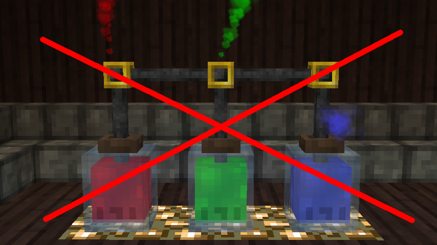
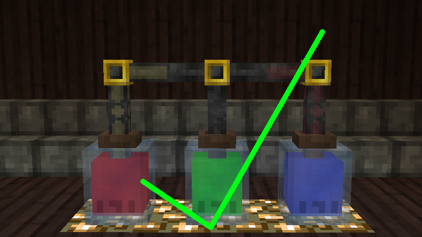
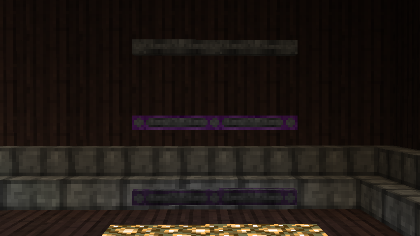

# Essentia Pipes
Do you like Thaumcraft, but find the essentia tube system frustrating? Do you find yourself wishing they behaved
like pipes from every other mod? Have you tried **Essentia Pipes**?

**Essentia Pipes** is an add-on to Thaumcraft 4 that adds a complimentary pipe system. Where normal essentia tubes
require convoluted setups to avoid different types of suction from conflicting with each other, a single line of
**Essentia Pipes** can connect to any number of jars, buffers, reservoirs, and more regardless of what suction types
those blocks are outputting.

## Features
* Three different flavors of **Essentia Pipes**: basic, thaumium, and voidmetal.
* Each comes in default grey, and with seven additional color variants!
* Configurable transfer rates for each type of **Essentia Pipe**.

